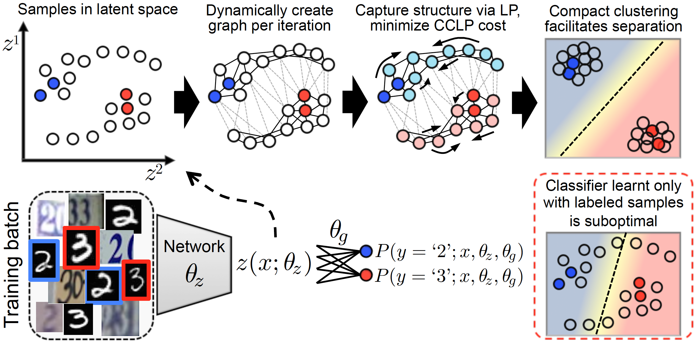
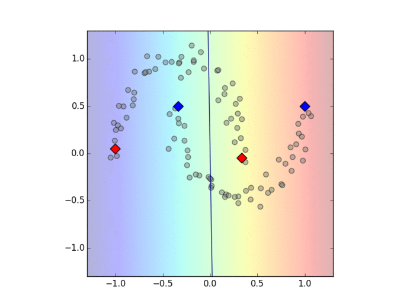
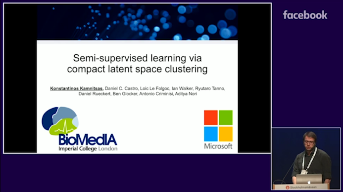

Semi-Supervised Learning via Compact Latent Space Clustering 
==============================================================

### News

June 2019:  
* Code (finally) released. Sorry for delay, I'm multi-tasking too much in my PhD.


### Introduction

This is demo code implementing a **semi-supervised** system to evaluate our method for semi-supervised learning of neural networks, proposed in [1].  

It implements a pipeline for loading a database (MNIST, SVHN, CIFAR10), dividing it into labelled and unlabelled subset, creating a neural network, train by learning from both labels and unlabelled data via our semi-supervised cost function, and evaluating.  

We hope that the proposed method will inspire further works. If these ideas or software positively influence your research, please cite the following paper (bibtex given at end of readme):

[1] **Konstantinos Kamnitsas**, Daniel C. Castro, Loic Le Folgoc, Ian Walker, Ryutaro Tanno, Daniel Rueckert, Ben Glocker, Antonio Criminisi, Aditya Nori, “[Semi-Supervised Learning via Compact Latent Space Clustering](https://arxiv.org/abs/1806.02679)”, *International Comference on Machine Learning, 2018*.


### Table of Contents
* [1. Method overview](#1-method-overview)
* [2. Installation requirements](#2-installation-requirements)
* [3. Installation](#3-installation)
* [4. Running the code](#4-running-the-code)
* [5. Code for main method only (CCLP cost)](#5-code-for-main-method-only-(CCLP-cost))
* [6. Concluding](#5-concluding)
* [7. Licenses](#6-licenses)


### 1. Method overview

The method aims to encourage compact clustering of a neural net's latent space to facilitate class separation, by taking into account structure in the latent space as revealed by processing both labelled and unlabelled data. The key idea is to:  
**a)** Every SGD iteration, **dynamically create a fully connected graph in the latent space**, over embeddings of both labeled and unlabeled samples in a batch. This enables modeling the underlying structure in feature space.  
**b)** We then proposed using **label propagation** to estimate high and low density regions in this space, which we noticed is **differentiable** and can thus be used it as a component in end-to-end learning.  
**c)** We proposed **a further constraint** for SSL on top of the cluster assumption for easy class separation: all samples belonging to the same class should form a **single** cluster.  
**d)** We then devise a cost function that regularizes the latent space to form a **single & compact cluster per class**, while **avoiding to disturb existing clusters** during optimization, because this would constitute loss of information (from the cluster-assumption) that enables label propagation.  

The above are illustrated in Figure 1 below:


**Figure 1**: Overview of our method. We dynamically construct a graph in the latent space of a network at each training iteration, propagate labels to capture the manifold’s structure, and regularize it to form a single, compact cluster per class to facilitate separation.

Here are examples of our method solving toy problems such as the setting where samples are embedded in a two-circles (Fig.2) and two-moons (Fig.3) arrangement in latent space:

  
**Figure 2**: Samples are assumed to be embedded in a two-circles arrangement in a 2D latent space. Shown are two labeled (red/blue) and multiple unlabeled points. Label propagation is applied, and then SGD iterations are performed using CCLP along with supervised cross entropy until convergence. Also shown are gradients by the supervised loss on labeled samples (yellow arrows) and by CCLP (black arrows).
  
  
  
**Figure 3**: Samples are assumed to be embedded in a two-moons arrangement in a 2D latent space. We see that gradients from CCLP on the unlabelled data (black arrows) follow along the structures of the clusters and avoid breaking them appart (see [1] for more details).
  
  
  
**Figure 4**: Finally, we show an example of an arrangement where an area of the manifold is ambiguous (not clear separation of the clusters). We see that label propagation assigns uncertain class-posterior to that area (white = 0.5 class posterior). Gradients applied by CCLP are of smaller magnitude in uncertain areas (more transparent black arrows) and of mixed directions. It does not try to create structure and separate the sides as it's uncertain. This is opposite to other approaches that try to move each sample to either side of the decision boundary. CCLP does not deal with the decision boundary, as it can be suboptimal. Things change when by randomness from initialization, a gap appears in the structure.
  
  
### Recorded oral presentation
  
[](https://vimeo.com/312298654)  
**Figure 5**: Click on the image above or this [link](https://vimeo.com/312298654) to be taken to a video with the recording of the oral presentation from ICML 2018.
  
  


### 2. Installation requirements

The system requires the following:
- [Python](https://www.python.org/downloads/): Tested both with python 2 and 3.
- [TensorFlow](https://www.tensorflow.org/): The Deep Learning library for back end.
- [numpy](http://www.numpy.org/) : General purpose array-processing package.
- [scipy](http://www.scipy.org/) : Scientific packages. Used for image operations e.g. augmentation.

Latest versions tested:  
As of June 2019, testing was done using Python 2.7.12 and 3.6.7, Tensorflow 1.12.0, numpy 1.16.1., scipy1.2.1  
Code wasnt tested with newer TF version yet, but should be ok, perhaps after (hopefully) minor changes. I plan to update versions and make sure code runs with new TF soon (sorry, I have a thesis to write asap).  

### 3. Installation
(The below are for unix systems, but similar steps should be sufficient for Windows.)

Clone the project with:
```
$ git clone https://github.com/Kamnitsask/semisuper-cclp/
```
After cloning it, all dependencies can be installed as described below.

#### Install using virtual environment (preferred)

If you do not have sudo/root privileges on a system, we suggest you install using a virtual environment.
From a *bash* shell, create a virtual environment in a folder that you wish:  
```cshell
$ virtualenv -p python3 FOLDER_FOR_ENVS/ve_tf_cclp     # or python2
$ source FOLDER_FOR_ENVS/ve_tf_cclp/bin/activate       # If using csh, source ve_tf_cclp/bin/activate.csh
```

Then continue with the steps below, to install rest of requirements:
```cshell
$ pip install numpy
$ pip install scipy
$ pip install tensorflow-gpu
```

#### GPU processing - Installing CUDA
Please consult installation guide at [Nvidia’s CUDA](https://developer.nvidia.com/cuda-toolkit).  
We highly suggest you also install *cuDNN* ([link to instructions](http://docs.nvidia.com/deeplearning/sdk/cudnn-install/index.html#download)).


### 4. Running the code

#### Data

Download data for MNIST, SVHN, or CIFAR somewhere on your disk. Add the **absolute** paths to those files in the config file:
```
./configs/local_dirs_to_data.py
```

#### Configuration

Configuration files are given, from which one can specify which database to use, how much data, which model, and various metaparameters.  

Example config files that are similar to those used for the publication are given in:
```
./configs/(mnist/svhn/cifar)/cfg_(mnist/svhn/cifar).py
```

#### Run it

The main, entry-point script for the project is `./run.py`.  
It requires as arguments a) a configuration file b) an output folder with option `-o` c) number of a gpu to use with option `-dev`:

For example, run it with:
```cshell
python ./run.py ./configs/svhn/cfg_svhn1k.py -o ./output/svhn1k/ -dev 0
```

The process will start, read the config file, create the model, train it, and evaluate its performance every few epochs.
Everything will be logged at `./output/svhn1k/logs` and every few epochs, the model will be saved at `./output/svhn1k/trainTf`.  
It will also save tensorflow-summaries about important variables throughout training at `./output/svhn1k/summaries/`. These can be visualised with:
```cshell
$ tensorboard --logdir=./output/svhn1k/summaries/
```


### 5. Code for main method only (CCLP cost)

Perhaps you are mostly interested in the implementation of the main method in [1] and not the wrapper (training loop, network architecture etc).  
The whole proposed method  essentially constitutes a single cost-function (CCLP cost).  
The cost function can be found at:
```
./cclp/neuralnet/trainers/losses/add_cclp_loss(...arguments...)
```

This takes as input the embeddings (activations) of the last hidden layer, from a forward pass with a neural network, when processing labelled and unlabelled samples in a batch.
This function will then perform the rest: dynamic graph construction over each batch, label propagation, optimize over markov chains.  
We (hopefully) managed to document the code enough, so check the code for more details.
The file with the cost function is standalone and should be easy to copy-paste in other projects to use the cost function in other neural nets.


### 6. Concluding

The proposed method should be easy to copy-paste in other projects and neural nets. We found it useful not just in settings with limited data, but even when all labels are used (see Sec.5 and Table 1 of our paper [1]). Thus we expect it to be useful for a variety of works.  

Recent work investigated our proposed method in a different task, semi-supervised learning on Natural Language Processing ([Chen et al, NAACL'19](https://arxiv.org/abs/1904.06475))! Seeing the method useful for a different task made us super-proud! If you find it useful in your task, please let us know, we would be glad to hear :-)

We hope that the proposed method will inspire further works. If these ideas or software positively influence your research, please cite the following paper:

```
@inproceedings{Kamnitsas2018SemiSupervisedLV,
  title={Semi-Supervised Learning via Compact Latent Space Clustering},
  author={Konstantinos Kamnitsas and Daniel C. Castro and Lo{\"i}c Le Folgoc and Ian Walker and Ryutaro Tanno and Daniel Rueckert and Ben Glocker and Antonio Criminisi and Aditya V. Nori},
  booktitle={International Conference on Machine Learning},
  year={2018}
}
```
  
  
Finally, please be aware this is demo-code, full re-implementation of the original to be cleaner to read and use. It is intended to help the scientific community understand, use and extend the proposed method. I am well aware that much of the functionality is not fully modular, the API far from perfect, but time during a PhD student's life is very limited. I will do my best to support issues. Feel free to email me with your feedback or any issues at: **konstantinos.kamnitsas12@ic.ac.uk**

Best wishes,

Konstantinos Kamnitsas


### 7. License

Copyright (c) 2018, Konstantinos Kamnitsas

This program is free software; you can redistribute and/or modify
it under the terms of the Apache License, Version 2.0. See the 
accompanying LICENSE file or read the terms at:
http://www.apache.org/licenses/LICENSE-2.0

A copy of this license is present in the root directory.


